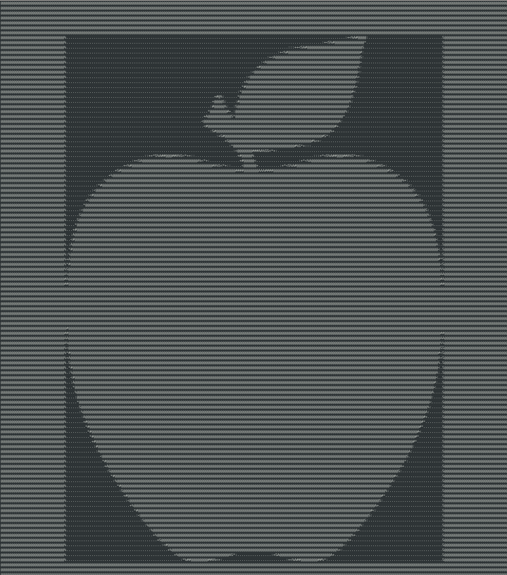

# ASCII-Art-Generator

<p align="center">

</p>
<body>
<p>ASCII art generator. Utilizes system arguments and file I/O</p>
</p>
<h2>Prerequisites</h2>
  <ul>
    <li>Python 2.7 or 3</li>
    <li>Text editor with preferences set to font size 4</li>
    <li>Usage with the desired file to convert as index 1</li>
  </ul>

<h2>Features</h2>
  <ul>
    <li>Imports Image module if not present on device</li>
    <li>Utilizes system arguements</li>
  </ul>
  
### Usage

```
python PhoneBook.py image-file-name
```
## Author

* **Rebecca Louie** - - (https://github.com/rebecca-louie)
